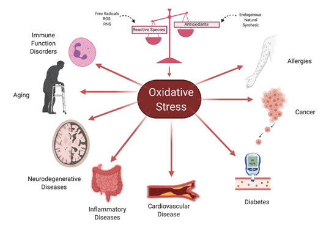
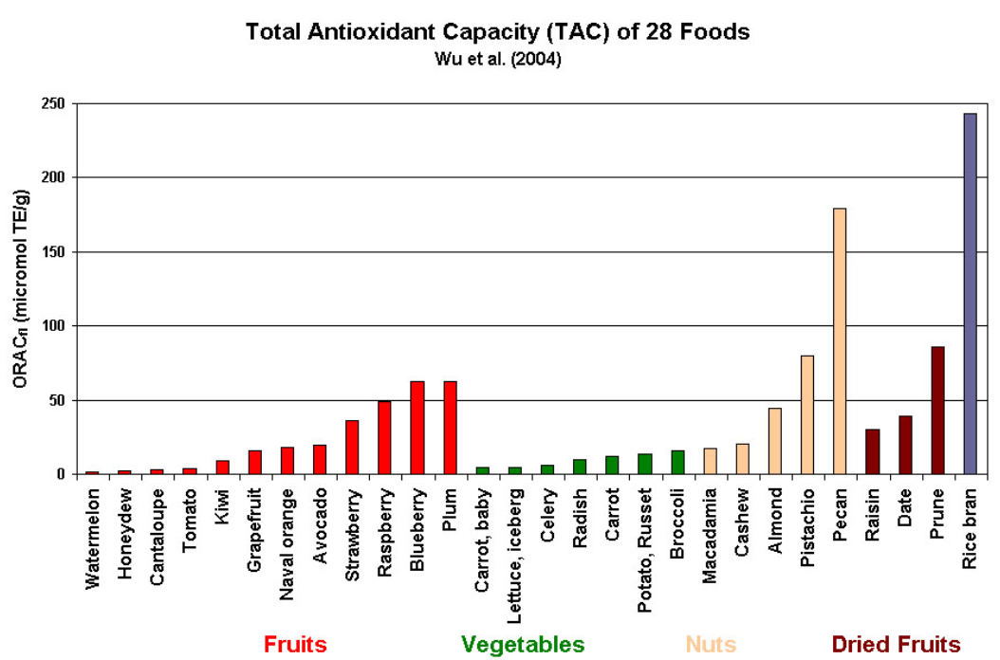

# **Basics: What Are Antioxidants and Why Do They Matter?**

## Introduction

Antioxidants are substances that can delay or prevent the oxidation of other molecules, even when present in small amounts. According to Halliwell and Gutteridge, antioxidants function at multiple points in the oxidative process. In the case of lipid peroxidation — a process where free radicals damage fats in the body — antioxidants act in five main ways:

1. Reducing localized oxygen concentration.  
2. Scavenging free radicals to prevent chain initiation.  
3. Binding metal ions to stop them from producing radicals.  
4. Breaking down peroxides to prevent them from restarting the oxidative cycle.  
5. Interrupting radical chain reactions that cause further damage.

---

## **What is Oxidative Stress?**
  

Oxidative stress refers to an imbalance between pro-oxidants (like reactive oxygen species) and antioxidants in the body. When pro-oxidants outweigh antioxidants, reactive species can damage essential biomolecules — including DNA, RNA, lipids, and proteins.

These reactive oxygen species (ROS) are produced naturally in the body through mitochondrial activity and other cellular processes. However, external factors like smoking, pollution, UV radiation, and toxins can also elevate ROS levels.

> ⚠️ **Note:** While ROS are necessary for certain immune responses (like attacking viruses), excess levels can lead to mutations, inflammation, and diseases such as cancer and cardiovascular disorders.

---

## **What is Lipid Peroxidation?**

Lipid peroxidation occurs when free radicals target polyunsaturated fatty acids in cell membranes. This process weakens the membrane structure, disrupts cellular function, and contributes to aging and disease. Antioxidants help block this cycle, either by neutralizing the radicals or preventing their formation.

---

## **Natural Antioxidants — And Their Role in Wine**

Our bodies rely on a combination of endogenous (produced internally) and dietary (consumed through food) antioxidants. Natural antioxidants are found in many fruits, vegetables, cereals, and teas — and notably, in red wine, thanks to compounds derived from grape skins and seeds.

**Key dietary antioxidants include:**

- Vitamin C (ascorbic acid)  
- Vitamin E (alpha-tocopherol)  
- Beta-carotene  
- Lycopene  
- Selenium  
- Flavonoids and polyphenols  

In wine, polyphenolic compounds like **resveratrol**, **catechins**, and **quercetin** are especially important. These compounds contribute not just to wine's flavor and color, but also to its potential antioxidant effects.

> 🧪 Research shows that the synergistic combination of these antioxidants — rather than isolated compounds — offers the greatest protection against oxidative stress.  
> This supports the idea that wine, as a complex mixture, may be more beneficial than any single supplement.

---

## **The Fine Balance**

While antioxidants are generally considered protective, there's a threshold. In high enough concentrations, some antioxidants can flip roles and act as **pro-oxidants**, potentially causing more harm than good. 

This is especially relevant in **cancer research**, where the goal is often to regulate ROS levels without tipping the balance.

