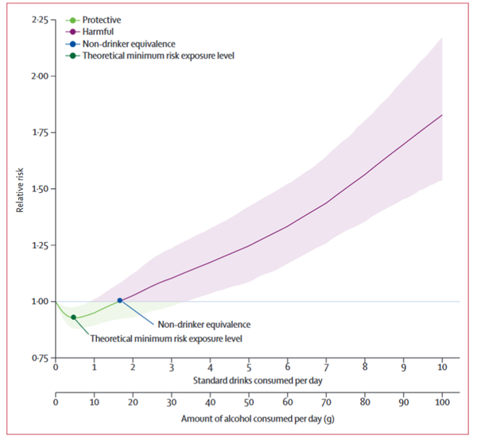
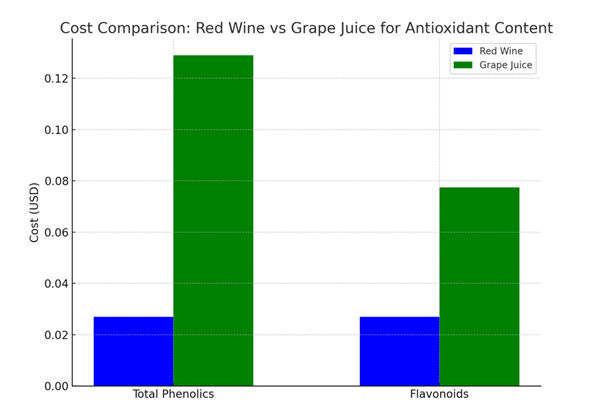

# **Alcohol and Health: A Review**

## **What Alcohol Does**

Alcohol (ethanol) is a psychoactive substance that acts as a central nervous system depressant. When consumed, it affects mood, cognition, coordination, and judgement. In the body, it’s metabolized by the liver and enters the bloodstream quickly. While small amounts may produce temporary feelings of relaxation or euphoria, alcohol can also impair function, damage organs over time, and lead to dependence or addiction with regular use.

---

## **Health and Cancer Risks Associated with Low Levels of Alcohol Consumption** 

Despite common perceptions, no level of alcohol consumption has been proven completely safe. According to the WHO, alcohol contributed to 3 million deaths globally in 2016 and is linked to over 200 diseases and injuries, including liver cirrhosis, mental health disorders, and seven types of cancer (like liver, colorectal, and breast cancer).

Even light-to-moderate drinking (less than 20g of pure alcohol per day, about 1.5L wine/week) was associated with 23,000 new cancer cases in the EU alone in 2017—with breast cancer accounting for nearly half. Notably, some of these cancers were tied to very low levels of consumption (under 10g/day).

---

## **Is There a Truly Safe Level of Alcohol Consumption?**

While some research has linked small amounts of alcohol to lower risks of cardiovascular disease and type 2 diabetes—especially in older adults—these benefits do not apply across the board.

The theoretical minimum risk exposure level (TMREL) varies across populations depending on age, region, and existing health risks. For younger people (15–39 years), this minimum risk level is often zero, meaning any alcohol raises their overall health risk. In contrast, older adults in regions with high rates of cardiovascular disease may benefit slightly from low levels of alcohol.

These findings emphasize that alcohol guidelines should be population-specific. A one-size-fits-all “safe limit” does not exist.

---

## **Final Takeaway**

The level of alcohol consumption that minimizes health risks varies significantly across populations. For many groups, particularly younger adults, the safest level is near zero. However, for older adults in regions with high cardiovascular disease rates, small amounts of alcohol might offer slight health benefits. Therefore, alcohol guidelines should be tailored to specific populations, as a one-size-fits-all “safe limit” does not exist.

---

## **Where Does Wine Fit In?**

Wine, particularly red wine, is often viewed more favorably due to its content of natural antioxidants like resveratrol, quercetin, and anthocyanins. These compounds are found in grape skins, seeds, and pulp — and may offer anti-inflammatory, cardiovascular, and even anticancer benefits.

However, these beneficial compounds are not exclusive to wine. Grape juice, especially red or purple varieties, contains many of the same antioxidants — but without the alcohol.

The key difference lies in the concentration and bioavailability. For instance, resveratrol is more abundant in fermented wine, while grape juice may retain more vitamin C and fewer tannins (which can irritate digestion). Wine’s alcohol content also affects absorption and metabolism — which may amplify or negate benefits depending on the dose and individual.

---

## **Let’s Quantify the Data**

| Antioxidant       | Grapes (mg GAE/g)     | Red Wine (mg GAE/mL) | White Wine (mg GAE/mL) | Key Observations                                                                                  |
|-------------------|------------------------|------------------------|--------------------------|----------------------------------------------------------------------------------------------------|
| Total Phenolics   | 0.095–0.686            | 3.225–3.313            | 0.379–0.482              | Red wine has the highest phenolic content, much higher than grapes and white wine.                 |
| Flavonoids        | 0.095–1.055            | 2.902–3.002            | 0.058–0.103              | Red wine shows a significant increase in flavonoids compared to both grapes and white wine.        |
| Anthocyanins      | Higher in red/purple grapes | 0.212–0.287      | Not detectable           | Red wine contains anthocyanins, while white wine has none.                                         |
| Catechins         | Present                | Present                | Present                  | Present in both grapes and wine; contribute to antioxidant activity.                               |
| Epicatechin       | Present                | Present                | Present                  | Found in both grapes and wine, with cardiovascular and antioxidant benefits.                       |
| Gallic Acid       | Present                | Present                | Present                  | Present in all, contributes to antioxidant and anticancer properties.                              |
| Quercetin         | Present                | Present                | Present                  | Known for anti-inflammatory and antioxidant effects.                                               |
| FRAP (Antioxidant Capacity) | N/A         | 0.0126–0.0127          | 0.0012–0.0019            | Red wine has significantly higher antioxidant capacity compared to white wine.                     |

> ###### GAE (Gallic Acid Equivalent): The amount of gallic acid required to provide the same antioxidant activity as the sample being measured.  

---

## **Conclusion & Recommendations**

- **Red Wine** stands out in terms of antioxidant capacity and health benefits due to its high content of phenolics, flavonoids, and anthocyanins. For those who enjoy wine, consuming moderate amounts of red wine could offer health benefits related to antioxidants and cardiovascular health, although it’s essential to consider the risks of alcohol consumption.

- **Grapes** are a great alternative for people who prefer to avoid alcohol but still want the antioxidant benefits, especially for heart health, anti-aging, and cancer prevention. They are rich in flavonoids and catechins, and the health benefits can be enjoyed without the risk of alcohol-related harm.

- **White Wine**, while still containing antioxidants, is less potent than red wine in this regard and may offer fewer health benefits compared to its red counterpart.

---

## **Economic Considerations: Antioxidants in Wine vs. Grape Juice**

### 1. Quantity of Grape Juice Needed to Match Antioxidants in Wine

To understand the antioxidant value in both beverages, let's look at how much grape juice is required to match the antioxidant content of 1 mL of red wine.

**Total Phenolics:**

- Red Wine: ~3.225–3.313 mg GAE/mL  
- Grape Juice: ~0.1 mg GAE/mL  
- Required Quantity of Grape Juice: ~32.25 mL of grape juice to match the phenolic content of 1 mL of red wine.

**Flavonoids:**

- Red Wine: ~2.902–3.002 mg GAE/mL  
- Grape Juice: ~0.15 mg GAE/mL  
- Required Quantity of Grape Juice: ~19.35 mL of grape juice to match the flavonoid content of 1 mL of red wine.

---

### 2. Cost Comparison: Red Wine vs. Grape Juice
 

- **Cost of Red Wine:**  
  - Price per bottle (750 mL): $15–$30 (assumed $20)  
  - Cost per mL of red wine: ~$0.027 USD/mL  

- **Cost of Grape Juice:**  
  - Price per bottle (1 liter): $3–$5 (assumed $4)  
  - Cost per mL of grape juice: ~$0.004 USD/mL  

| Antioxidant       | Wine (1 mL) Amount    | Grape Juice (Required mL) | Cost (Wine, 1 mL) | Cost (Grape Juice, Required) |
|-------------------|------------------------|-----------------------------|--------------------|-------------------------------|
| Total Phenolics   | ~3.225–3.313 mg        | ~32.25 mL                   | ~$0.027            | ~$0.129                       |
| Flavonoids        | ~2.902–3.002 mg        | ~19.35 mL                   | ~$0.027            | ~$0.0774                      |

---

*This review highlights that while red wine has high antioxidant content, grapes and grape juice offer comparable benefits without the health risks of alcohol — albeit at higher volume (and possibly cost) requirements.*
